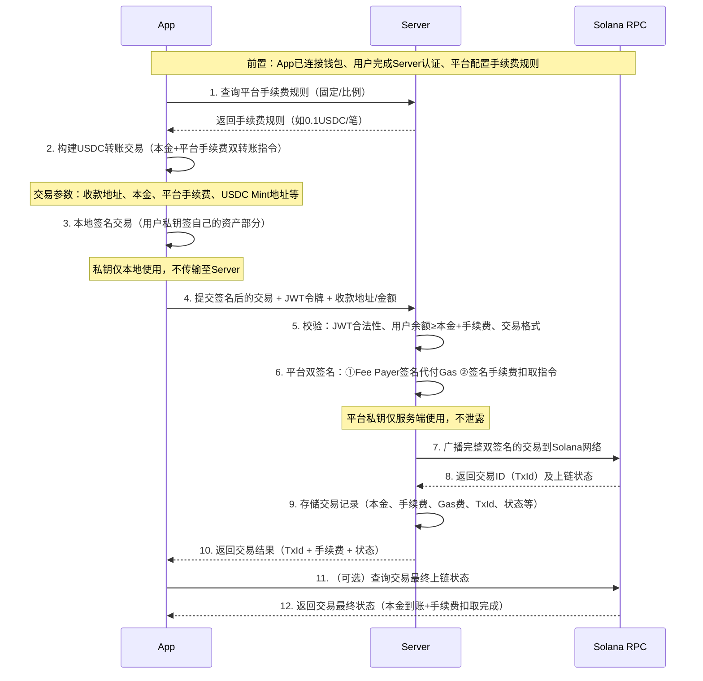

# Solana 稳定币（USDC）交易平台 - 技术文档
## 项目概述
本项目是基于 Solana 区块链的稳定币（USDC）交易平台，包含**前端 App**（Web/移动端）和**后端 Server** 两部分，核心实现 USDC 转账、余额查询、交易记录管理等功能。平台采用「客户端+服务端双签名」机制，实现**用户免 SOL 支付 Gas 费**（平台代付）、**平台抽取 USDC 手续费**（自动扣取），同时保障用户私钥安全（仅本地存储）。

### 核心特性
- 平台代付 Gas 费：用户无需持有 SOL，由平台 Fee Payer 账户支付交易 Gas 费；
- 平台抽取 USDC 手续费：转账时自动扣取固定/比例 USDC 手续费至平台账户，无额外 Gas；
- 双签名机制：App 签名用户交易主体（保障用户资产安全），Server 签名 Fee Payer 代付+手续费扣取（保障平台权益）；
- 私钥安全：用户私钥仅存储在客户端本地，交易签名全程本地化，不向服务端传输；
- 完整交易链路：支持 USDC 余额查询、转账发起、手续费扣取、交易上链、记录追溯全流程；
- 身份认证：服务端基于 JWT 实现用户身份校验，保障交易归属权；
- 多环境适配：支持 Solana Devnet/Testnet/Mainnet-beta 环境切换。

### 技术栈
| 模块       | 核心技术                                                                 |
|------------|--------------------------------------------------------------------------|
| 后端 Server | TypeScript + Express + MongoDB + Solana Web3.js + Spl-Token               |
| 前端 App   | React/Vue + Solana Wallet Adapter + Solana Web3.js + TypeScript          |
| 区块链层   | Solana RPC/WSS、USDC 代币合约、Fee Payer 代付机制、双签名交易            |

## 功能模块说明
### 一、Server 端核心功能
1. **用户认证模块**
   - 用户名/密码注册（密码 bcrypt 加密存储）；
   - JWT 令牌生成与校验，关联用户钱包地址；
   - 权限控制：仅认证用户可发起交易、查询记录。

2. **稳定币核心功能**
   - USDC 余额查询：根据用户钱包地址查询 Solana 链上 USDC 余额；
   - 手续费规则配置：支持固定/比例手续费（如 0.1 USDC/笔 或 0.1%/笔）；
   - 双签名交易处理：接收 App 签名的交易，补充平台 Fee Payer 签名+手续费扣取指令，广播交易；
   - 平台代付 Gas：用 Fee Payer 账户支付 Solana 交易 Gas 费；
   - 交易记录管理：MongoDB 存储交易 ID、转账金额、平台手续费、Gas 费、状态等信息，支持分页查询。

3. **配置与校验模块**
   - 环境变量校验（Solana RPC 地址、Fee Payer 私钥、USDC Mint 地址、平台手续费账户等）；
   - Solana 网络状态检测、交易状态回调校验；
   - 手续费扣取合法性校验（确保用户余额足够支付本金+手续费）。

### 二、App 端核心功能
1. **钱包连接模块**
   - 支持 Phantom/Solflare 等 Solana 钱包适配；
   - 本地获取钱包地址，不存储私钥，仅缓存地址用于身份关联。

2. **交易操作模块**
   - 构建含手续费的 USDC 转账交易（本金+平台手续费）；
   - 本地签名交易主体（用户资产相关部分）；
   - 提交签名后的交易到 Server，触发平台签名+代付+广播。

3. **数据展示模块**
   - 实时查询 USDC 余额（扣减手续费后预估到账金额）；
   - 展示历史交易记录（含本金、手续费、Gas 费）；
   - 交易状态实时更新（待处理/成功/失败）。

## 核心流程：稳定币交易（双签名+平台抽佣+代付Gas）
### 整体流程概述
App 端负责**构建含手续费的交易 + 本地签名用户资产部分**，Server 端负责**校验手续费 + 补充平台签名（代付 Gas+扣手续费） + 广播交易**，全程用户私钥不泄露，平台承担 Gas 费并抽取 USDC 手续费，核心流程如下：

